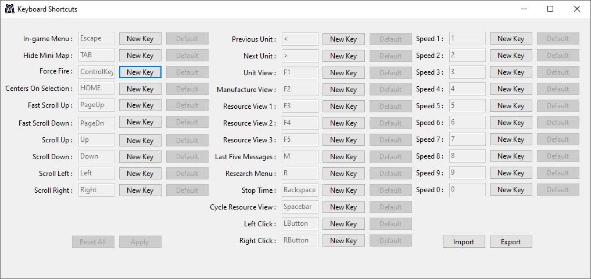
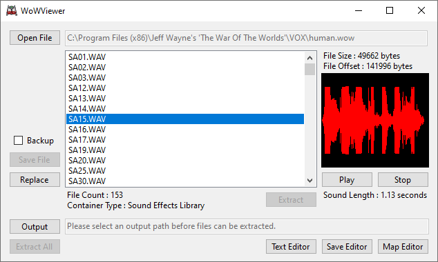

# WoW Revived

A revival project for the classic RAGE game Jeff Wayne's 'The War Of The Worlds'

The game is usually installed to "C:\Program Files (x86)\Jeff Wayne's 'The War Of The Worlds'" but you may install it elsewhere if you prefer — for example, into a dedicated folder for modding, preservation, or portable use.

NOTE : Do not use the installer, just follow the instructions below.

- 1 : Copy the Human disc contents to your installation folder.
- 2 : Rename the file "Human.cd" to "Human.cd.bak"
- 3 : Rename the folder "FMV" to "FMV-Human"
- 4 : Copy the Martian disc to your installation folder ( when prompted, choose *not* to replace files — or do, it doesn't matter anymore, but fewer writes are better for SSD longevity )
- 5 : Download the latest version from the Releases page, extract the contents and place the files in your install folder.
- 6 : Right-click the launcher and choose **Send to > Desktop (create shortcut)**, then launch it and enjoy the game!

LANGUAGES : If you install a language pack, make sure you do it now, alternatively if you have started the game as human, launch it as martian, then install the language pack.

COMPATIBILITY : Windows 11 users might have to adjust the properties for "WoW_patched.exe" by setting compatibility to Windows XP Service Pack 3 as well as setting the colour depth to 16 bit.

IE : Right click "wow_patched.exe" and go to the compatibility tab, then adjust the settings accordingly.

WARNING : The current audio "fix" has a "bug" or "feature" of being possible to play multiple tracks over one another, if playing tracks in the CD player, let them finish before selecting another.

ADDITIONAL : The launcher will automatically request administrator permissions to ensure registry settings are correctly applied.

If you choose to make a language patch using the text editor, feel free to send the "TEXT.ojd" file my way and I will add it to the releases.

WANTED : Regional Manuals : We are looking for high-quality scans of the original physical German (DE) and Spanish (ES) manuals. If you own a physical copy and can provide a scan, please join the Discord or open an Issue!

# Road Map

The road map for this project.
- [✅ 0 : Main Game Functionality](#main-game-functionality) ( 99% Complete )
	- Languages supported:
		- 1\. English
		- 2\. French
		- 3\. German
		- 4\. Italian
		- 5\. Spanish
	- Known "bugs" which I consider non-issues for the time-being.
		- 1\. Selecting the Credits from the options menu crashes the game. ( doesn't crash when the resolution is set to 640x480 )
		- 2\. Finishing the game leads to the Credits and also crashes the game. ( doesn't crash when the resolution is set to 640x480 )
	- Features I am considering adjusting.
		- 1\. Heat-ray construction limit of 12, I may add this limit to the launcher when I locate the relevant values.
- [✅ 1 : Custom Launcher](#custom-launcher) ( Fully Functional - 95% Complete )
	- Dynamic language pack detection. (WIP - not enabled currently)
	- Advanced registry settings options.
	- Custom keyboard shortcut settings. (WIP - not enabled currently)
	- Automatic regeneration of base registry settings, making the installation portable.
	- Automatic cleanup of unnecessary files and Smackw32.dll moved to main directory.
	- Custom pre-set difficulty settings. (Easy, Medium[default], Hard)
- [✅ 2 : File Extractor](#file-extractor) ( Fully Functional - 100% Complete )
	- .WoW archives can be extracted.
	- Waveform preview, play and replace sound files from .WoW archives.
- [❌ 3 : Save Editor](#save-editor) ( Partially Implemented - 10% Complete )
	- Save Name, Time & Date editing functionality implemented, along with Swap Sides and Delete Save buttons.
	- Override standard limit of 1753 as the minimum date and set the year manually to as low as year zero.
	- Sector & Area names loaded dynamically from TEXT.ojd
- [✅ 4 : Text Editor](#text-editor) ( 100% Complete - edit and save string entries in the TEXT.ojd file. )
	- All 1397 strings are editable. ( Default game has 1396, new string added for the missing Credits button text, original files also supported )
	- UTF-8 + ISO-8859-1 encoding supported.
	- File is recompiled from scratch based on modifications.
	- Import & Export as .txt file.
	- Undo changes to current string.
	- Edited strings highlighted.
	- Rich text editing with newline support (\n to \r\n handling when loading and the opposite when saving )
- ❌ 5 : Map Editor ( Basic Parsing Implemented - 1% Complete )
	- Basic parsing of .nsb filetypes.
	- .ojd files can be parsed, but there is still more decoding to do.
- ✅ 6 : No-CD Music Fix ( 99% Complete )
	- Uses a shim that allows for localised audio playback.
- ❌ 7 : Video Playback Intercept ( Researching Solution - 0% Complete )
	- Looking at intercepting smackw32.dll and redirecting it to use the more modern binkw32.dll for higher resolution video playback.
	- Determining the best solution for upscaling and remastering the original videos.
- ❌ 8 : Decomp/Recomp ( Started - 1% Complete )
	- Begun mapping out virtual key addresses for use in the launchers custom keyboard shortcut settings. ( "WoWRevived\WoWDecomp\ida-map.txt" )

This might not all happen but I wanted to create a more accessible guide for running the game on modern systems, while the information exists much of it is scattered across the internet.

Discord server : https://discord.gg/bwG6Z3RK8b

## Main Game Functionality

Critical Event Options - Edited

This was fixed by adding two leading spaces to the TEXT.ojd file for these entries.

  

Critical Event Options - Unedited

  

Display Settings - Edited

This was fixed by patching the executable to jump past the instructions to create these buttons.

  

Display Settings - Unedited

  

## Custom Launcher

Custom Keyboard Shortcuts - Work In Progress - Not Currently Enabled

  

Advanced Settings

  

## File Extractor

  

## Save Editor

## Text Editor

## Credit

Thanks to old-games.ru and the author for the original executable patch and winmm.dll shim which I used as a basis for my own fix : https://www.old-games.ru/forum/threads/patchi-vozvraschajuschie-cd-audio-the-patchs-to-restore-cdda-playback.51778/#post-877625

Thanks to Dan Redfield for the Credits patch to the TEXT.ojd file which I then used as reference to patch the other languages versions of that file.

Thanks to RetroKet for setting up and managing the Discord server as well as encouragement and helping identify some bytes in the .WoW archive format.