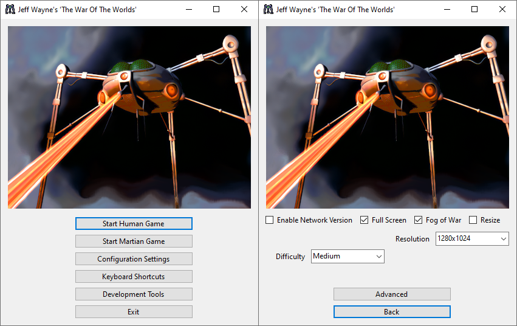
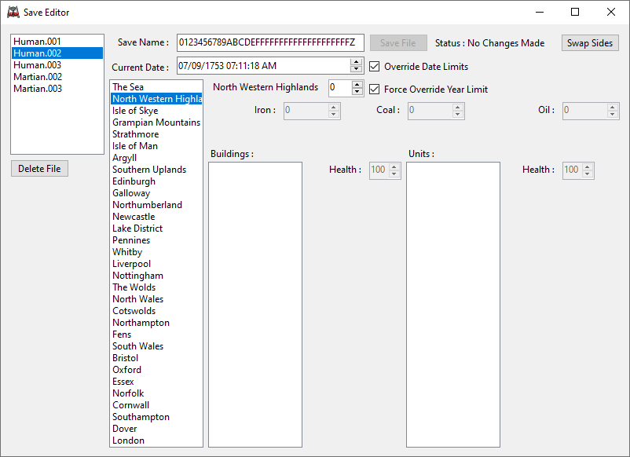
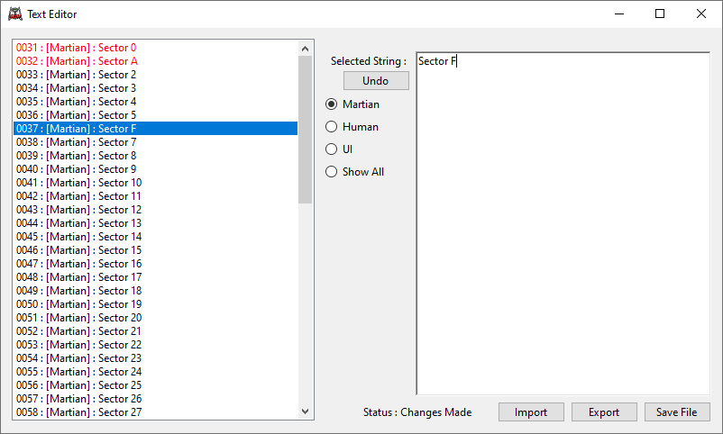

# WoW Revived

A revival project for the classic RAGE game Jeff Wayne's 'The War Of The Worlds'

The game is usually installed to "C:\Program Files (x86)\Jeff Wayne's 'The War Of The Worlds'", but you may install it elsewhere if you prefer — for example, into a dedicated folder for modding, preservation, or portable use.

- 1 : Copy the Human disc contents to your installation folder.
- 2 : Rename the file "Human.cd" to "Human.cd.bak"
- 3 : Rename the folder "FMV" to "FMV-Human"
- 4 : Copy the Martian disc to your installation folder ( when prompted, choose *not* to replace files — or do, it doesn't matter anymore, but fewer writes are better for SSD longevity )
- 5 : Download and extract "wowpatch.zip" from : https://www.old-games.ru/forum/threads/patchi-vozvraschajuschie-cd-audio-the-patchs-to-restore-cdda-playback.51778/#post-877625
- 6 : Download the launcher from the Releases page and and place it in your install folder.
- 7 : Right-click the launcher and choose **Send to > Desktop (create shortcut)**, then launch it and enjoy the game!

The launcher will automatically request administrator permissions to ensure registry settings are correctly applied.

If anyone really wants to save themselves 15.2mb's of space or wants to save writes that badly, check "unnecessary-files.txt" for a list of files that do not need to be copied from the discs, there are also four files not needed from "wowpatch.zip" which are the four "winmm_driver9x" files.

Language options are currently hidden, as no confirmed non-English PC versions of the game have been found. If you happen to own or know of a different language release, please let us know as support can easily be added if needed.

Or, if you choose to make a language patch using the text editor, feel free to send the "TEXT.ojd" file our way and I will re-active the dropdown option in the menu and integrate language selection options!

# Road Map

The road map for this project.
- [✅ 1 : Custom Launcher](#custom-launcher) ( Fully Functional - 90% Complete )
	- Dynamic language pack detection.
	- Advanced registry settings options.
	- Custom keyboard shortcut settings. (WIP)
- [✅ 2 : File Extractor](#file-extractor) ( Fully Functional - 90% Complete )
	- .WoW archives can be extracted.
	- Waveform preview and play sound files from .wow archives.
	- .ojd files can be parsed, but there is still more decoding to do.
- [❌ 3 : Save Editor](#save-editor) ( Partially Implemented - 10% Complete )
	- Save Name, Time & Date editing functionality implemented, along with Swap Sides and Delete Save buttons.
	- Override standard limit of 1753 as the minimum date and set the year manually to as low as year zero.
	- Sector & Area names loaded dynamically from TEXT.ojd
- [✅ 4 : Text Editor](#text-editor) ( 100% Complete - edit and save string entries in the TEXT.ojd file. )
	- All 1396 strings are editable.
	- UTF-8 + ISO-8859-1 encoding supported.
	- File is recompiled from scratch based on modifications.
	- Import & Export as .txt file.
	- Undo changes to current string.
	- Edited strings highlighted.
	- Rich text editing with newline support (\n to \r\n handling when loading and the opposite when saving )
- ❌ 5 : Map Editor ( Basic Parsing Implemented - 1% Complete )
	- Basic parsing of .nsb filetypes.
- ❌ 6 : No-CD Music Fix ( Researching Solution - 0% Complete )
	- Looking at building mini-isos from the disk and mounting at runtime.
- ❌ 7 : Video Playback Intercept ( Researching Solution - 0% Complete )
	- Looking at intercepting smackw32.dll and redirecting it to use the more modern binkw32.dll for higher resolution video playback.
	- Determining the best solution for upscaling and remastering the original videos.
- ❌ 8 : Decomp/Recomp ( Not Started - 0% Complete )
- ❌ 9 : Remake ( Not Started - 0% Complete )

This might not all happen but we wanted to create a more accessible guide for running the game on modern systems, while the information exists much of it is scattered across the internet.

Discord server : https://discord.gg/bwG6Z3RK8b

# Screenshots

Screenshots of the current progress for the toolkit.

## Custom Launcher
WoWLauncher

Custom Keyboard Shortcuts

  

## File Extractor
WoWViewer - File Extractor

  

## Save Editor
WoWViewer - Save Editor

## Text Editor
WoWViewer - Text Editor

